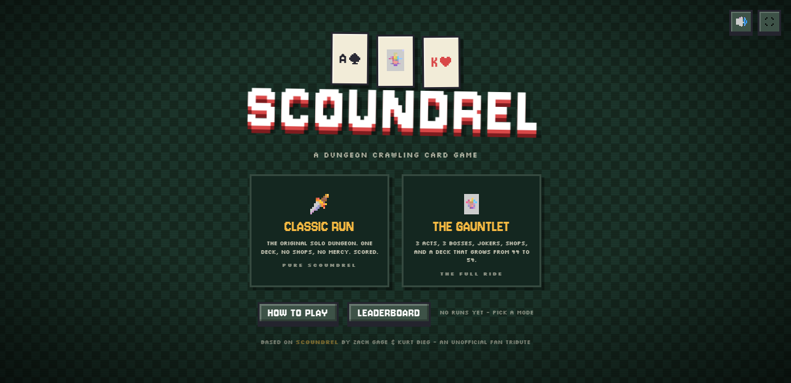
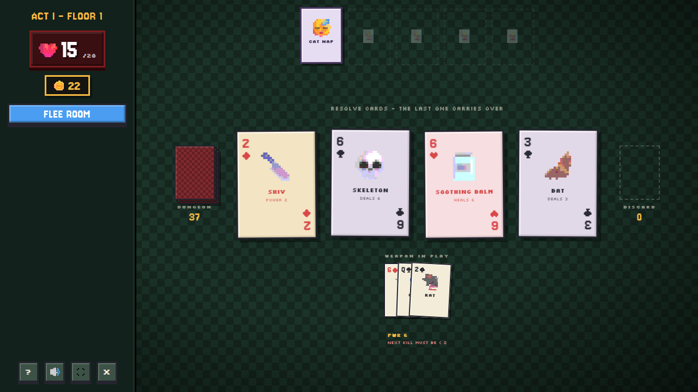
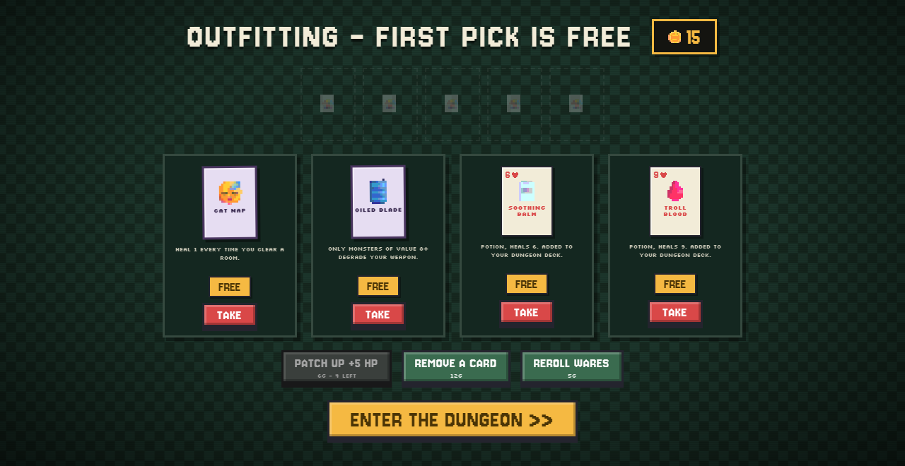
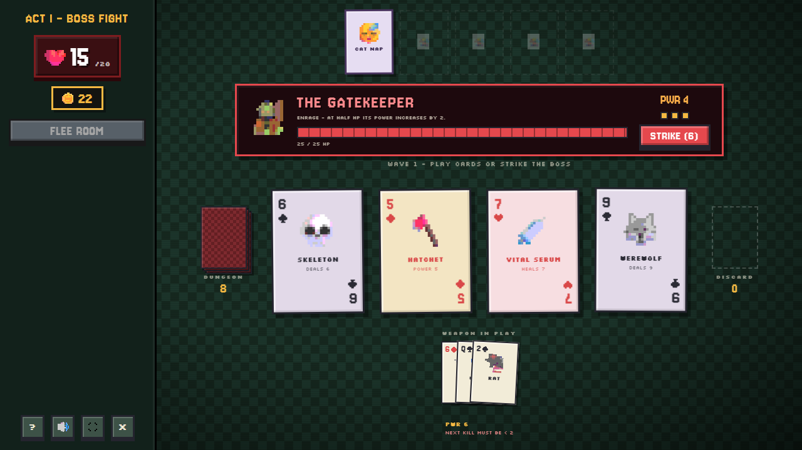
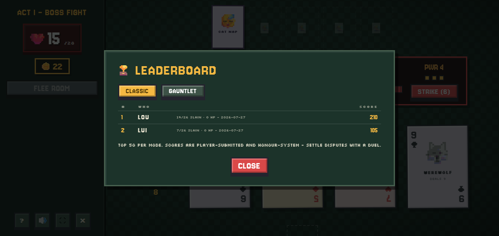

# SCOUNDREL — a dungeon crawling card game

<p align="center">
  <a href="https://lewismconte.github.io/scoundrel/">
    
  </a>
</p>

<p align="center">
  <b>Free · no install · no sign-up · runs in any browser, phone or desktop</b>
</p>

<p align="center">
  <a href="https://lewismconte.github.io/scoundrel/">
    
  </a>
</p>

**One deck is the dungeon.** Cards deal out four at a time; spades and clubs are monsters,
diamonds are weapons, hearts are potions. You have 20 HP and no way to run for long.

The catch is your sword. It cuts down whatever you point it at — but **every kill must be
weaker than the last one**, so a good weapon blunts itself on the way down and you are
always choosing between a clean kill now and a usable blade later. That one rule is the
whole game.

A run takes about ten minutes. You will lose the first few.

<p align="center">
  <a href="https://lewismconte.github.io/scoundrel/">
    
  </a>
</p>

<sub>Your weapon keeps every monster it has killed fanned beneath it, and the line under the
stack is the ceiling for the next kill. It only ever falls. Sooner or later the blade is
worth less than the one lying in the room, and you have to decide when to drop it.</sub>

## Two ways to play

| | |
|---|---|
| **CLASSIC RUN** | The original game, faithfully. One 44-card dungeon, no shops, no bosses, no mercy. Everyone competes on the same deck, so it is the honest leaderboard. |
| **THE GAUNTLET** | The full ride. 3 acts × (2 floors + a boss), 23 Jokers, shops and deckbuilding. Your first pick is free, and **the deck grows as you descend** — 44 cards in Act I, the court joins for Act II (49), the crown jewels complete all 54 in Act III, right as the monsters toughen up. |

<table>
<tr>
<td width="50%"></td>
<td width="50%"></td>
</tr>
<tr>
<td><b>The Smuggler's Camp</b> between floors — buy Jokers, add or remove cards from your deck, patch up, reroll the wares.</td>
<td><b>Bosses</b> end each act. Three actions per wave: spend them on the room or STRIKE, then it hits back.</td>
</tr>
</table>

## The leaderboard

Runs autosave to your device, so you can close the tab and come back. Finish one and you
can put it on a global **top-50 board per mode** — type three initials, and your rank comes
straight back. No account, no login, no waiting.

Every run is also **timed**, and the board sorts by it: click the **TIME** column to flip
from high score to fastest run. The clock never pauses — deliberating in the camp is part
of your time — but it does stop while the tab is closed, so a run picked up the next
morning doesn't read fourteen hours. Only completed runs rank by time; dying in the first
room is quick for the wrong reason, and those entries sit below the finishers however fast
they were.

<p align="center">
  
</p>

Scores live in a tiny Cloudflare Worker (`worker/`) backed by KV, comfortably inside the
free tier. If it is ever unreachable the board falls back to `leaderboard.json` in this
repo, and from there to your own device's best runs, so the panel is never empty.

It is honour-system, and openly so: the score is computed on the player's machine, so
nothing stops a determined person posting a fake one. The in-game note says as much.

## Running it yourself

Open `index.html` in any modern browser. That's it — no build step, no dependencies, no
package manager. (For dev, any static server works: `python -m http.server --directory
scoundrel`.) On phones the layout reflows to a stacked, thumb-friendly view, hover
tooltips become tap-to-reveal, and there's a fullscreen button next to mute.

## The rules in full

**Core Scoundrel rules, kept faithful:**

- The dungeon is a deck. Each **room** deals 4 cards; resolve them one at a time and the
  last one carries into the next room.
- **♠ ♣ are monsters** — fight barehanded (take full value) or with a weapon (take value −
  power). Weapons **degrade**: each kill must be *weaker than the last*.
- **♦ are weapons**, **♥ are potions** (only the first potion per room works).
- You may **flee** an untouched room — never twice in a row.

**The roguelike layer:**

- **3 acts × (2 floors + a boss)**. Floors are your dungeon deck reshuffled; clearing one
  earns gold and opens the shop.
- **23 Jokers** — passive relics in the Balatro sense (Whetstone, Vampire Fang, Guardian
  Angel, Oiled Blade…). Five slots. Choose them well.
- **The Smuggler's Camp** between floors: buy Jokers, add cards to your deck, remove cards
  from it, patch up, reroll the wares.
- **All 54 cards** exist: red face cards are one-shot **Allies** (The Blacksmith reforges
  your weapon, The Templar grants shield…), red aces are legendaries (the **Kingslayer**,
  the **Elixir of Life**), and the two printed Jokers are **Jesters** that grant a random
  Joker on sight.
- **Bosses** end each act: waves of 3 actions — spend them on room cards or **STRIKE** —
  then the boss hits back. Each has a gimmick (Enrage / Miasma / royal escalation).
- **Floor modifiers** from Act II (Plague, Horde, Brittle Steel, Darkness, Blood Moon).

## Art direction

Pixel art, generated at runtime — no sprite sheets:

- All creature/item art is **emoji rasterized at ~14px onto a canvas**, alpha-crunched
  (hard edges) and posterized (6 levels/channel), then scaled up with
  `image-rendering: pixelated`. Instant 16×16-style sprites for every card, joker and boss.
- Suit symbols are hand-drawn **8×8 pixel maps** in `js/pixel.js`.
- Fonts: **Jersey 10** (display) + **Silkscreen** (body), flat colours, hard offset
  shadows, bevelled panels, dithered checkerboard felt, scanlines. Motion stays smooth —
  pixel assets, Balatro juice.
- **The table is laid out like the printed rules diagram**: face-down Dungeon pile on the
  left, the room of 4, face-up Discard on the right, weapon-in-play with its fan of slain
  monsters beneath. Click either pile to browse it.
- **Cards physically fly**: deals stream out of the Dungeon pile, slain monsters land on
  your weapon stack, potions fly into your HP, barehanded monsters lunge at you, Jesters
  fly to the joker bar, and fleeing hurls the whole room back into the deck.
- **Q/K/A monsters are minibosses**: black-hole aura — stepped-rotation vortex, collapsing
  suction rings, dark wisps pulled in from the felt, and a pulsing dread glow.
- **Mobile**: on ≤720px the desktop row becomes a compact top vitals bar + a stacked table
  (piles on top, room in a 2×2 grid, weapon below). Hover tooltips become **tap-to-reveal**
  on touch devices so Joker text is reachable by thumb, and `touch-action` kills the tap
  delay. Fullscreen button hides itself on devices that can't fullscreen an element (iPhone).

## Files

```
index.html         shell
style.css          the felt, the cards, the pixels
js/pixel.js        runtime pixel-sprite pipeline (emoji → crunched canvas + suit maps)
js/sfx.js          synthesized Web Audio sound effects
js/data.js         cards, jokers, bosses, floor modifiers
js/engine.js       game rules + state machine (emits events)
js/ui.js           rendering, floaters, shake, particles, modals
js/main.js         boot & wiring
worker/            leaderboard Worker — see worker/README.md to deploy your own
leaderboard.json   offline fallback board
tools/             screenshot capture for this README (node tools/screenshots.mjs)
```

Every image above is a real capture, not a mockup: `tools/screenshots.mjs` serves the repo,
drives the game in headless Chrome over the DevTools Protocol, and plays an actual run
until the table is worth photographing. Zero dependencies. Re-run it after any visual
change.

Stats, mute preference and the in-progress run persist in `localStorage`. The save carries
a version tag; when the shape of a run changes incompatibly the tag is bumped and old
saves are retired rather than migrated, so a stale save can never corrupt a run.

## Credits

- Scoundrel rules by **Zach Gage & Kurt Bieg** ([rules PDF](http://stfj.net/art/2011/Scoundrel.pdf))
- Feel and juice principles inspired by **Balatro** (LocalThunk) and the
  [Balatro-Feel](https://github.com/mixandjam/Balatro-Feel) breakdown by mixandjam
